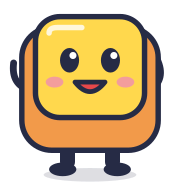

# Tasto dopo tasto ⌨️

<p align="center">
  
</p>

Un allenatore di tastiera in italiano per bambine e bambini di 7–9 anni.
Si impara a scrivere con dieci dita giocando, guidati da **Tastino**, il tasto più simpatico del mondo.
È un sito statico costruito con [Deno](https://deno.com), [Lume](https://lume.land) e CSS vanilla: funziona nel browser, senza account e senza server.

> **Come è nato questo progetto.** Tasto dopo tasto è stato sviluppato con l'aiuto di strumenti di intelligenza artificiale, ma è stato ideato e revisionato da due persone: una che sviluppa software, per la parte tecnica, e una che insegna a scuola, per i contenuti, il linguaggio e il percorso didattico.

## Indice

- [Obiettivi](#obiettivi)
- [Le tre aree](#le-tre-aree)
- [Stack](#stack)
- [Requisiti](#requisiti)
- [Comandi](#comandi)
- [Struttura del progetto](#struttura-del-progetto)
- [Dove sono i testi](#dove-sono-i-testi)
- [Scelte tecniche](#scelte-tecniche)
- [Privacy](#privacy)
- [Licenza](#licenza)

## Obiettivi

- **A chi si rivolge**: bambine e bambini della scuola primaria (7–9 anni) che usano per la prima volta una tastiera, a scuola o a casa.
- **Cosa insegna**: la posizione delle dita sulla riga centrale, quale dito usa quale tasto, le righe in alto e in basso, maiuscole, punteggiatura, accenti e numeri della tastiera italiana.
- **Come**: lezioni brevi e guidate, giochi (palloncini, pioggia di parole, cronometro), premi e distintivi.
- **Cosa non è**: non è un test di velocità per adulti e non raccoglie dati. È in italiano, per la tastiera con layout italiano.

## Le tre aree

1. **Storia** (`/storia/`): sei slide sulla nascita della tastiera, dalla scrittura a mano alle tastiere virtuali. Si sfogliano con le frecce ← → della tastiera, con i bottoni sullo schermo o scorrendo col dito.
2. **Allenamento** (`/allenamento/`): nove lezioni guidate, circa 35 minuti in tutto, con la tastiera italiana e le manine colorate che mostrano quale dito usare. Alla fine si vince un distintivo, che si può scaricare in PNG.
3. **Sfida** (`/sfida/`): otto livelli di livello intermedio, con punti, moltiplicatore, stelle e una bacheca dei record.

| Allenamento | Sfida |
| --- | --- |
| 1. Pronti, dita... via! | 1. Riscaldamento |
| 2. La casa della mano sinistra | 2. Frasi da campioni |
| 3. La casa della mano destra | 3. Accenti all'italiana |
| 4. G e H, indici sportivi | 4. Numeri in fila |
| 5. Le vocali volanti | 5. Pioggia di parole |
| 6. In cima alla tastiera | 6. Scioglilingua |
| 7. Giù in cantina | 7. Corsa contro il tempo |
| 8. Maiuscole e puntini | 8. Il campione delle tastiere |
| 9. Il gran finale | |

## Stack

| Parte | Strumento |
| --- | --- |
| Runtime e task | [Deno](https://deno.com) 2 |
| Generatore di siti statici | [Lume](https://lume.land) 3 (template [Vento](https://vento.js.org), `.vto`) |
| Contenuti | Markdown con frontmatter YAML |
| Stili | CSS vanilla moderno, senza preprocessori né framework |
| Interattività | JavaScript con moduli ES nativi, senza bundler e senza dipendenze |
| Grafica | SVG inline (illustrazioni, mascotte, manine), Canvas (coriandoli, distintivo) |
| Suoni | Web Audio API, suoni sintetizzati al momento |
| Font | Fredoka e Andika da [Bunny Fonts](https://fonts.bunny.net) |
| Salvataggi | `localStorage` del browser |

## Requisiti

- Per sviluppare: [Deno](https://deno.com) 2.x. Lume viene scaricato da Deno al primo avvio, non c'è niente da installare.
- Per giocare: un browser recente (Chrome, Edge, Firefox o Safari aggiornati) e una **tastiera fisica con layout italiano**. Su un dispositivo touch compare un avviso.

## Comandi

```sh
deno task serve     # sito in locale su http://localhost:3000 con ricarica automatica
deno task dev:host  # come serve, ma raggiungibile da altri dispositivi in rete (http://<ip-della-macchina>:3000)
deno task build     # genera il sito statico in _site/
```

La cartella `_site/` si può pubblicare così com'è su qualsiasi hosting statico (GitHub Pages, Netlify, un server della scuola...). Prima di pubblicare, indica l'indirizzo vero del sito, anche se è in una sottocartella: serve per i link interni e per le anteprime quando il sito viene condiviso sui social o nelle chat.

```sh
deno task build --location https://esempio.it/tastiera/
```

Su GitHub Pages ci pensa il workflow `.github/workflows/pages.yml`: a ogni push su `main` genera il sito con l'indirizzo giusto e lo pubblica.

## Struttura del progetto

```text
.
├── _config.ts            # configurazione di Lume
├── deno.json             # import e task
├── docs/                 # immagini per questo README
└── src/
    ├── index.md          # home
    ├── storia/           # presentazione e slide
    ├── allenamento/      # trainer e lezioni
    ├── sfida/            # trainer e livelli
    ├── testi/            # testi comuni dell'interfaccia
    ├── _includes/
    │   ├── layouts/      # home, storia, trainer, base
    │   ├── partials/     # mascotte
    │   └── illustrazioni/# SVG delle slide e delle icone
    ├── js/
    │   ├── comune.js     # codice di tutte le pagine
    │   ├── storia.js     # presentazione
    │   ├── trainer/      # motore di allenamento e sfida (input, punteggio)
    │   └── lib/          # tastiera, mani, suoni, coriandoli, distintivo, memoria...
    └── styles/           # CSS diviso per livelli (@layer)
```

## Dove sono i testi

Tutti i testi stanno in file Markdown con frontmatter YAML dentro `src/`, così chi insegna può modificarli senza toccare il codice. Il codice sta in `_includes/`, `js/` e `styles/`.

| File | Contenuto |
| --- | --- |
| `src/index.md` | Home: titolo, fumetto di Tastino, le tre aree, le regole d'oro |
| `src/testi/interfaccia.md` | Testi comuni: menu, piè di pagina, nomi delle dita, immagine e testo alternativo dell'anteprima social |
| `src/storia/index.md` | Descrizione della pagina e testi dei bottoni della presentazione |
| `src/storia/slide/*.md` | Una slide per file (`ordine`, `anno`, `illustrazione`, `colore`, `curiosita` + testo) |
| `src/allenamento/index.md` | Testi del trainer: messaggi, complimenti, distintivo e animali |
| `src/allenamento/lezioni/*.md` | Una lezione per file |
| `src/sfida/index.md` | Testi della sfida: punteggi, record, bacheca |
| `src/sfida/livelli/*.md` | Un livello per file |

I file dentro `slide/`, `lezioni/`, `livelli/` e `testi/` non diventano pagine. Hanno `soloContenuto: true` (impostato nei `_data.yml`), quindi i layout li leggono con `search` ma Lume non li pubblica.

### Scrivere una lezione o un livello

```yaml
---
title: Il titolo
ordine: 3            # posizione sulla mappa
emoji: "🏡"
nuovi_tasti: K L Ò   # mostrati come tasti sulla mappa
obiettivo: Frase breve per la mappa
stelle: [400, 1000, 1800]  # solo sfida, facoltativo: punti per 1, 2 e 3 stelle
passi:
  - tipo: parla        # Tastino spiega; si continua con SPAZIO/INVIO
    testo: "Testo con **grassetto**"
    mostra: jklò       # facoltativo: tasti da illuminare
  - tipo: scrivi       # scrivere un testo, tasto per tasto
    istruzione: Cosa fare
    testo: la sala
    aiuto: tardi       # facoltativo: il suggerimento arriva dopo 3 secondi
  - tipo: palloncini   # gioco: scoppia i palloncini con la lettera giusta
    istruzione: Scoppia i palloncini!
    lettere: asdf
    quanti: 14
  - tipo: pioggia      # (sfida) parole che cadono; durata, vite, velocita, parole
  - tipo: cronometro   # (sfida) più parole possibile in `durata` secondi
---
Il testo qui sotto è la presentazione iniziale di Tastino.
```

Nella sfida, se un livello non ha `stelle`, le soglie si calcolano da sole in base al punteggio perfetto possibile.

## Scelte tecniche

- **CSS vanilla moderno**: `@layer`, nesting nativo, colori `oklch()` e `color-mix()`, container queries (anche di dimensione, per il cielo dei giochi), `:has()`, `@property` per animare variabili, `@starting-style`, funzioni trigonometriche `sin()`/`cos()`, animazioni legate allo scroll (`animation-timeline: view()`) e View Transitions, sia tra le pagine (`@view-transition`) sia dentro la pagina (slide e schermate del trainer). Con `prefers-reduced-motion` le animazioni si spengono.
- **JavaScript**: moduli ES nativi, senza bundler e senza dipendenze.
- **SVG** per illustrazioni, mascotte e manine. **Canvas** per coriandoli e distintivo. **Web Audio** per i suoni, sintetizzati, senza file audio.
- **Font** da [Bunny Fonts](https://fonts.bunny.net): Fredoka per i titoli e l'interfaccia, Andika (pensato per chi impara a leggere) per le lettere da scrivere.
- **Contenuti separati dal codice**: lezioni, livelli e slide sono file Markdown, quindi si aggiungono o si correggono senza programmare.

## Privacy

Progressi, nome e record restano nel browser (`localStorage`). Non c'è nessun server, nessun account, nessun tracciamento: nessun dato lascia il computer. Se il browser blocca il salvataggio (per esempio in navigazione privata) il gioco funziona lo stesso, ma i progressi durano solo per quella visita.

## Licenza

Codice e contenuti sono distribuiti con la licenza [CC BY-NC-SA 4.0](https://creativecommons.org/licenses/by-nc-sa/4.0/deed.it): puoi usare, copiare, ridistribuire e modificare Tasto dopo tasto liberamente, citando gli autori, a patto che il risultato resti gratuito e con la stessa licenza. Non è permesso usarlo per creare prodotti o materiali a pagamento.

Il riassunto in italiano è in [`LICENZA.md`](LICENZA.md), il testo legale completo in [`LICENSE`](LICENSE).
